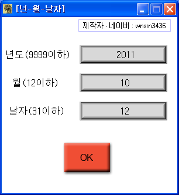

# Jurassic Primitive War 2: The Ranker Version Changer

Inside `jw2_01.trc`, the data archive of Jurassic Primitive War 2: The Ranker, the game's version date is stored in two places, two bytes for the year and one byte each for the month and day. This tool has those spots hard coded and rewrites them to any date you want, through a GUI with an input form.

**Compatible version**: Jurassic Primitive War 2: The Ranker v2003.12.29

<p>
  
</p>


## How to use

Download from Releases, extract and run it, and a file dialog opens first. Pick `jw2_01.trc` from the game folder and the current version date is read into the three fields.

Click a field to start typing and enter a number. Clicking elsewhere ends input. The year cannot exceed 9999, the month 12, or the day 31.

Pressing OK rewrites the trc file in place. There is no undo, so back up `jw2_01.trc` first.

The offsets are hard coded, so it only works on a trc whose original version is 2003.12.29.


## How it works

**The year is two bytes, so it has to be split.** Only the year runs from 0 to 9999 and does not fit in one byte. It is converted to hex, then two characters are peeled off from the end at a time and converted back to decimal, and those are the byte values. 2011 becomes `07DB`, split into `DB` and `07` and written low byte first. GameMaker 8 has no base conversion functions, so the hex conversion is a hand written script.

```gml
// sk_cut_hex.gml - peel off two characters from the end to make a byte
stringeses = string_copy(num1, length-1, length)
num1 = string_delete(num1, length-1, length)
stringsrfg[j] = sk_dec_conversion(stringeses)
```

The month and day never exceed 12 and 31, so they are written as single bytes with no conversion.

**Writing copies the whole file and swaps in only the target bytes.** The trc is read byte by byte from start to end into `tmp.trc`, and when the version date position comes up, the input values are written instead of the originals. Once everything is copied, it overwrites the original and the temporary file is deleted.

```gml
for(i=0; i!=file_size; i+=1)
{
  file_bin_seek(open_file, i)
  file_message = file_bin_read_byte(open_file)

  file_bin_seek(save_file, i)
  file_bin_write_byte(save_file, file_message)

  if i=1117006
  {
    sk_cut_hex(sk_hex_conversion(real(obj_year.vares)))
    file_bin_seek(save_file, i+1)
    file_bin_write_byte(save_file, real(stringsrfg[0]))
    file_bin_seek(save_file, i+2)
    file_bin_write_byte(save_file, real(stringsrfg[1]))
    i+=2
  }
  ...
}
```

The `1117006` in the source is decimal, the same value as `0x110B4E`.

Reading has the same shape. The format is not parsed; the whole file is scanned and the bytes at the known indexes are picked up. Since the offsets are fixed, a trc from any other version would have the wrong spots touched.


## Files

| Path | Contents |
|---|---|
| `source/jw2-version-changer.gmk` | Original project file |
| `source/split/` | Text tree produced by GmkSplitter |
| `docs/screenshots/` | Screenshots |
| Releases | Executable and usage notes |


## Credits

The Korean text scripts under `source/split/Scripts/한글드로우/` were written by 김게맛 (sodium031) of the GameMaker community.


## License

zlib. See [LICENSE](LICENSE). Bundled libraries made by other people keep their own licenses.
